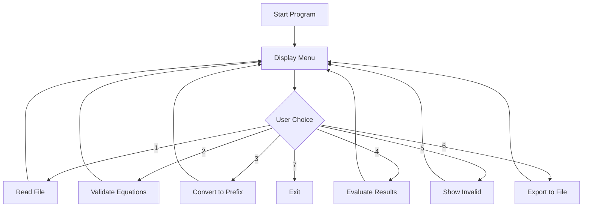

# 🧮 Math Equation Solver

A C program that validates, converts, and evaluates mathematical equations using advanced data structures including stacks and linked lists. The program supports infix to prefix conversion and provides detailed equation analysis.

## 📋 Table of Contents

- [✨ Features](#-features)
- [🚀 Getting Started](#-getting-started)
  - [Prerequisites](#prerequisites)
  - [Installation](#installation)
  - [Usage](#usage)
- [📔 Menu Options](#-menu-options)
- [📁 Project Structure](#-project-structure)
- [💡 Examples](#-examples)
- [🛠️ Technical Details](#️-technical-details)
- [👨‍💻 Author](#-author)

## ✨ Features

- 🔍 **Equation Validation**: Comprehensive validation of mathematical expressions
- 🔄 **Format Conversion**: Convert infix expressions to prefix notation
- 📊 **Expression Evaluation**: Calculate results of valid mathematical expressions
- 📂 **File I/O**: Read equations from files and export results
- 🧮 **Multiple Operations**: Support for +, -, *, /, ^ operators
- 🎯 **Bracket Support**: Handle (), {}, [] parentheses types
- 📝 **Detailed Error Reporting**: Specific error messages for invalid equations
- 💾 **Data Persistence**: Save results to output files

## 🚀 Getting Started

### Prerequisites

- GCC compiler or any C compiler
- Windows/Linux/macOS operating system
- Basic understanding of mathematical expressions

### Installation

1. **Clone the repository**
   ```bash
   git clone https://github.com/osaidnur/Math-Equation-Solver.git
   cd Math-Equation-Solver
   ```

2. **Compile the program**
   ```bash
   gcc -o equation_solver P2_1210733_OsaidNur_1.c -lm
   ```

3. **Run the program**
   ```bash
   ./equation_solver
   ```

### Usage

1. **Prepare input file**: Create a text file with mathematical equations (one per line)
2. **Run the program**: Execute the compiled binary
3. **Follow the menu**: Choose from 7 available operations
4. **View results**: Check terminal output or generated output files

## 📔 Menu Options

The program offers a comprehensive menu-driven interface:

| Option | Description |
|--------|-------------|
| **1** | 📥 Read equations from file |
| **2** | ✅ Check validity of equations |
| **3** | 🔄 Convert valid equations to prefix form |
| **4** | 🧮 Evaluate equations and show results |
| **5** | ❌ Display invalid equations |
| **6** | 💾 Export all data to output file |
| **7** | 🚪 Exit program |


### 1. 📥 Read equations from file
- **Purpose**: Load mathematical equations from a text file
- **How it works**: 
  - Prompts you to enter the filename (e.g., `input.txt`)
  - Reads equations line by line from the file
  - Stores each equation in a linked list for processing
- **Example**: If your file contains `2+3*4`, it will be loaded into memory

### 2. ✅ Check validity of equations
- **Purpose**: Validate all loaded equations and display their status
- **How it works**:
  - Goes through each equation in the linked list
  - Checks for balanced parentheses, proper operators, valid syntax
  - Displays "Valid" or specific error messages for each equation
- **Example Output**: `Equation (1) -> Valid..` or `Equation (2) -> Invalid! , there is two consecutive operators`

### 3. 🔄 Convert valid equations to prefix form
- **Purpose**: Transform valid infix equations to prefix notation
- **How it works**:
  - Only processes equations marked as valid
  - Converts from infix (e.g., `2+3*4`) to prefix (e.g., `+2*34`)
  - Displays the prefix form for each valid equation
- **Example**: `2+3*4` becomes `+2*34`

### 4. 🧮 Evaluate equations and show results
- **Purpose**: Calculate the numerical result of valid equations
- **How it works**:
  - Converts valid equations to prefix form internally
  - Uses stack-based evaluation to compute results
  - Displays the final numerical answer
- **Example**: `2+3*4` evaluates to `14.000000`

### 5. ❌ Display invalid equations
- **Purpose**: Show all equations that failed validation
- **How it works**:
  - Lists only the equations marked as invalid
  - Helps identify which equations need correction
- **Useful for**: Debugging input files with syntax errors

### 6. 💾 Export all data to output file
- **Purpose**: Save complete analysis to `output.txt`
- **How it works**:
  - Creates a comprehensive report file
  - Includes prefix forms and results for valid equations
  - Marks invalid equations with error status
- **Output file**: `output.txt` in the same directory

### 7. 🚪 Exit program
- **Purpose**: Safely terminate the application
- **How it works**: Closes files and frees memory before exiting


### Validation Rules

The program validates equations based on:
- ✅ Balanced parentheses: `()`, `{}`, `[]`
- ✅ No consecutive operators: `+-`, `*/`, etc.
- ✅ No alphabetic characters
- ✅ Proper operator-operand relationships
- ✅ Valid equation structure


## 📁 Project Structure

```
Math-Equation-Solver/
├── 📄 P2_1210733_OsaidNur_1.c    # Main source code
├── 📄 input.txt                   # Sample input equations
├── 📄 output.txt                  # Generated output file
├── 📄 project 2.pdf              # Project documentation
└── 📄 README.md                   # This file
```

## 💡 Examples

### Sample Input (`input.txt`)
```
2+(14-9)+4*[6+(7+5)-1]
2+(14-9)+4[6+(8+5)-1]
2+(5-3)*7-20/4
```

### Expected Output
```
Equation (1) -> Valid..
Equation (2) -> Invalid! ,There is no operator between ) and [
Equation (3) -> Valid..

Equation (1) Prefix form >>>  +2+*4+-+765+149
Equation (3) Prefix form >>>  -*+5327/204

Equation (1) result = 51.000000
Equation (3) result = 9.000000
```

### Program Flow


## 🛠️ Technical Details

### Data Structures Used

- **Stack**: For expression evaluation and parentheses validation
  ```c
  typedef struct nodeS *Stack;
  struct nodeS {
      double data;
      Stack next;
  };
  ```

- **Linked List**: For storing multiple equations
  ```c
  typedef struct nodell *linked_list;
  struct nodell {
      char s[10000];
      int valid;
      linked_list next;
      linked_list prev;
  };
  ```

### Key Algorithms

1. **Infix to Prefix Conversion**
   - Reverse the infix expression
   - Swap parentheses
   - Convert to postfix
   - Reverse the result

2. **Expression Evaluation**
   - Parse prefix expression from right to left
   - Use stack for operand storage
   - Apply operators to stack elements

3. **Validation Algorithm**
   - Check balanced parentheses using stack
   - Validate consecutive characters
   - Ensure proper operator placement

### Operator Precedence

| Operator | Precedence | Associativity |
|----------|------------|---------------|
| `^`      | 3          | Right         |
| `*`, `/` | 2          | Left          |
| `+`, `-` | 1          | Left          |
| `(`, `{`, `[` | 0     | -             |

---

## 👨‍💻 Author

- **Osaid Nur**

